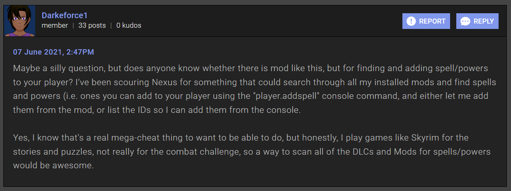

> **Directly inspired by the [AddItemMenu][] mod** _by [towawot](https://www.nexusmods.com/skyrimspecialedition/users/3138394)_

# Add Spell Menu

[AddItemMenu][] is a _sweet mod_ by [towawot][] (_who also created the epic mod [AutoHarvest][]_)

I was searching for the C++ code for AddItemMenu (_to help me learn C++_) when I found this post in the Nexus forums for the mod by [Darkeforce1][]:

> 

I thought this might make a good _example project_ for my screencasting series: **[Skyrim Scripting][]**

So I wrote it!

It is entirely written in Skyrim scripts ([Papyrus][]).  
No C++ was required thanks to a function provided by the lovely **[powerofthree's Papyrus Extender][]** mod.  
The function lets you easily get all spells in the game (_or all spells from a certain mod_).

You can find **[Add Spell Menu][]** posted on NexusMods: 

You can find the **[screencast playlist]** showing how to create the mod on [Skyrim Scripting][].

[AddItemMenu]: https://www.nexusmods.com/skyrimspecialedition/mods/17563
[towawot]: https://www.nexusmods.com/skyrimspecialedition/users/3138394
[AutoHarvest]: https://www.nexusmods.com/skyrimspecialedition/mods/17622
[Darkeforce1]: https://www.nexusmods.com/skyrimspecialedition/users/53452326
[Skyrim Scripting]: http://skyrimscripting.com
[Papyrus]: https://www.creationkit.com/index.php?title=Category:Papyrus
[powerofthree's Papyrus Extender]: https://www.nexusmods.com/skyrimspecialedition/mods/22854
[Add Spell Menu]: #
[screencast playlist]: #